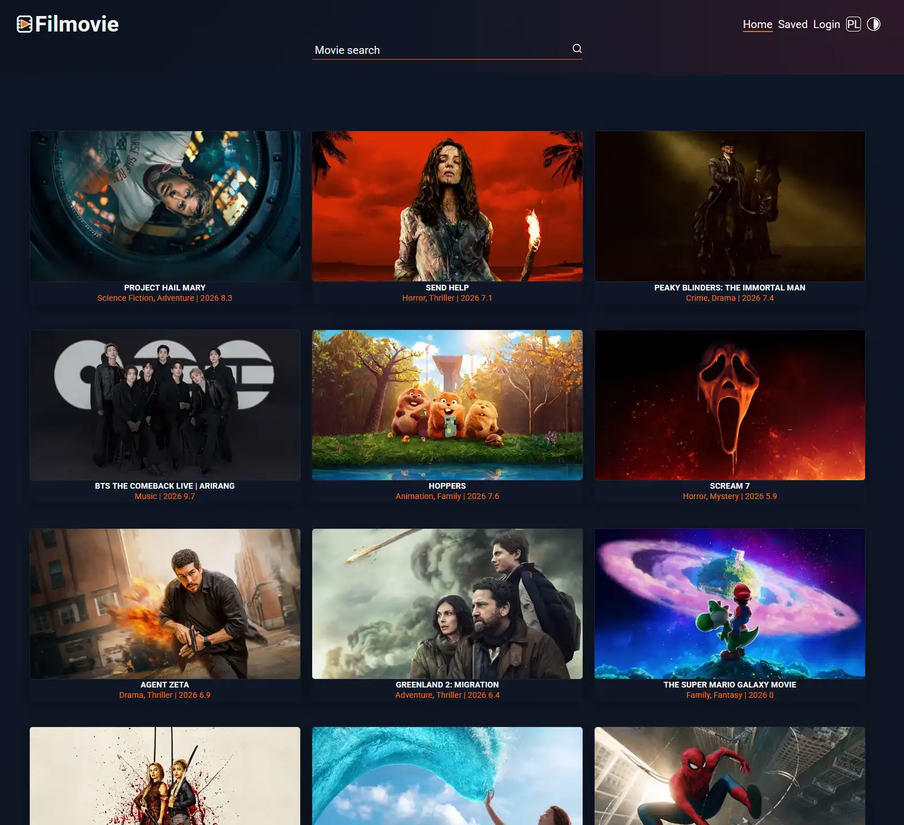
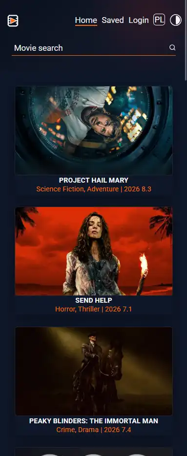

# Filmovie

Filmovie is a movie discovery web application built as an independent continuation and refactor of a
course group project ("Filmoteka").

It allows users to browse trending movies, search by title, open a movie details modal, and manage
personal movie lists (`Watched` / `Queue`) in the Library view.

## Live Demo

https://mikel538.github.io/Filmovie/

## Screenshots

### Desktop



### Mobile



## Features

- Browse trending movies (TMDB)
- Search movies by title
- Infinite scrolling on the home page
- Movie details modal (rating, popularity, original title, genres, overview)
- Language switcher (`EN` / `PL`)
- Fallback to English overview when a Polish description is unavailable
- Personal Library page with:
  - `Watched` list
  - `Queue` list
- Local storage persistence for movie lists
- Responsive layout (mobile / tablet / desktop)
- Notifications and loading indicators
- Login modal UI prepared (backend integration in progress)\*

## Tech Stack

- HTML
- SCSS
- TypeScript
- Parcel
- REST API
- Async JavaScript
- API integration
- Search functionality
- Responsive design

## Libraries / Integrations

- **TMDB API** - movie data source
- `axios` - HTTP client
- `notiflix` - notifications and loading indicators
- `basiclightbox` - lightbox support
- `modern-normalize` - CSS normalization

## Project Structure (High Level)

- `src/index.html` - Home page (trending/search)
- `src/library.html` - Library page (Watched / Queue)
- `src/ts/api/` - API layer (TMDB + backend-ready auth/list sync)
- `src/ts/features/` - page-level controllers
- `src/ts/ui/` - rendering, modal population, search, scroll, notifications
- `src/partials/` - reusable HTML partials
- `src/scss/` - styles and responsive SCSS structure
- `src/images/` - application assets and screenshots

## Getting Started

### Prerequisites

- Node.js (recommended: current LTS)
- npm

### Installation

```bash
npm install
```

### Run Development Server

```bash
npm run dev
```

### Build for Production

```bash
npm run build
```

## Available Scripts

- `npm run dev` - starts Parcel in development mode
- `npm run build` - builds a production bundle for GitHub Pages (`/Filmovie/`)

## Notes

- The project is currently frontend-first.
- Login UI and backend synchronization hooks are prepared, but full backend authentication is still
  in progress.
- `Watched` and `Queue` lists currently work via `localStorage`.

## Project Background

This project started as a refactor and personal continuation of a course group project
("Filmoteka").

`Filmovie` is the independent version used for further development and portfolio presentation.

## Author

**Michal Lipiak**

- GitHub: https://github.com/MikeL538
