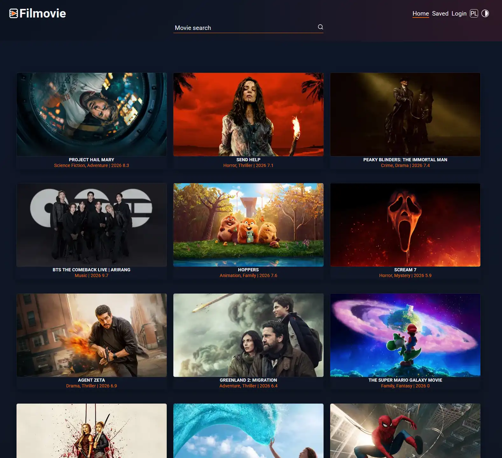
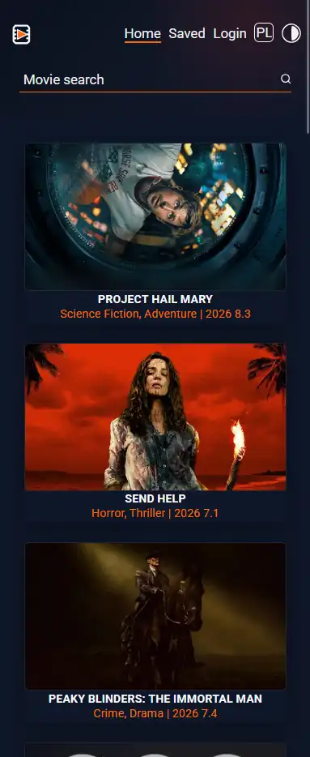

# Filmovie

Filmovie is a TypeScript movie discovery web app for browsing trending titles, searching TMDB, and
managing personal movie lists in guest mode or authenticated mode. The project started as an
independent continuation of the original course project known as "Filmoteka" and has since grown
into a frontend application with backend integration for authentication, password reset, and list
synchronization.

## Live Demo

Frontend: filmovie.mikeldev.online

Backend API Repo: https://github.com/MikeL538/Filmovie-Server

Backend API: https://filmovie-server.onrender.com

## Features

- Browse trending movies from TMDB
- Search movies by title
- Infinite scroll on the home page
- Movie details modal with poster, rating, popularity, genres, and overview
- Add and remove movies from `Watched` and `Queue`
- Library page with separate `Watched` and `Queue` tabs
- `EN` / `PL` language switching with persisted selection
- Light and dark theme switching with persisted selection
- Registration and login modals
- Account verification flow handled by the backend
- Verification-email resend flow for unverified accounts
- Forgot-password modal and dedicated reset-password page
- User list synchronization with the backend after login
- Local `localStorage` persistence for guest usage and session continuity
- Responsive layout for mobile, tablet, and desktop
- Notifications and loading states, including Render cold-start feedback

## Pages

- `index.html` for movie discovery, search, auth modals, and movie details
- `library.html` for the saved `Watched` and `Queue` lists
- `reset-password.html` for completing password reset from an email link

## Screenshots

### Desktop



### Mobile



## Tech Stack

### Frontend

- TypeScript
- HTML partials
- SCSS
- Parcel 2
- Axios
- Notiflix
- Infinite Scroll
- TMDB API

### Backend Integration

Filmovie is integrated with a separate backend project that currently provides:

- user registration
- login and logout
- email/account verification flow
- verification-email resend
- forgot-password and reset-password flow
- user movie lists: `watched` and `queued`
- list persistence and sync between sessions
- deployed API on Render

Backend repository used for integration: https://github.com/MikeL538/Filmovie-Server

## How It Works

### Guest mode

Without logging in, users can browse movies, search titles, open details, manage their library
locally, switch language, and switch theme. Guest movie lists are stored in `localStorage`.

### Authenticated mode

After logging in, Filmovie downloads the user's `watched` and `queued` lists from the backend,
stores them in local storage, and keeps updates synchronized through API requests.

### Verification flow

The backend requires account verification before login is allowed. When the server reports an
unverified account, the frontend can trigger the resend-verification flow.

### Password reset flow

Users can open the forgot-password modal, request a reset link by email, and complete the password
change on the dedicated `reset-password.html` page.

## Project Structure

```text
src/
  index.html                        Home page
  library.html                      Library page
  reset-password.html               Password reset page
  index.ts                          Home page entry
  main.ts                           Shared app bootstrap
  library.ts                        Library page bootstrap
  reset-password.ts                 Password reset entry
  ts/api/                           TMDB and backend API integration
  ts/features/                      Page-level controllers and auth sync
  ts/ui/                            Rendering, search, auth, modals, notifications, theme
  partials/                         Reusable HTML partials
  scss/                             Responsive styles
  images/                           App assets and README screenshots
```

## Requirements

- Node.js LTS
- npm

## Installation

```bash
npm install
```

## Environment Setup

Create a `.env` file in the project root:

```env
TMDB_API_TOKEN=your_tmdb_bearer_token
```

The frontend reads the TMDB bearer token from `process.env.TMDB_API_TOKEN`.

## Running The Project

### Frontend only

```bash
npm run dev
```

This starts Parcel and serves all HTML entry points used by the app.

### Frontend with backend

To use registration, verification, password reset, login, logout, and list sync locally:

1. Run the Filmovie frontend.
2. Run the `Filmovie-Server` backend.
3. Open the frontend from Parcel.

The frontend currently chooses backend URL automatically:

- local development: `http://localhost:3000`
- deployed backend: `https://filmovie-server.onrender.com`

The switch is based on `window.location.hostname`.

## Available Scripts

```bash
npm run dev
npm run build
```

- `npm run dev` starts Parcel in development mode
- `npm run build` creates a production build for GitHub Pages with `--public-url /Filmovie/`

## State And Persistence

- auth token is stored in `localStorage` under `filmovie_server_token`
- guest and synced movie lists are stored in `localStorage` under `toWatchList` and `queueList`
- selected language is stored in `localStorage` under `language`
- selected theme is stored in `localStorage` under `theme`

## Important Integration Notes

- TMDB data is fetched through a bearer token stored in `.env`
- auth state is stored in `localStorage`
- guest movie lists are stored in `localStorage`
- after login, backend lists are loaded into local storage and kept in sync
- the frontend supports logout through the backend API
- the deployed backend runs on Render, so cold starts can cause delayed responses on the first auth
  request
- CORS on the backend is configured for local Parcel development and GitHub Pages

## Main Code Areas

- `src/main.ts` initializes shared UI logic, language handling, theme handling, modals, trailer
  support, auth sync, and global interactions
- `src/ts/features/homeMoviesController.ts` handles trending movies, searching, and infinite scroll
- `src/ts/features/libraryMoviesController.ts` renders the Library page and tab switching
- `src/ts/features/devAuthSync.ts` synchronizes login state and backend lists
- `src/ts/ui/movieListService.ts` manages watched/queue state and backend sync calls
- `src/ts/ui/modalLogin.ts`, `src/ts/ui/modalRegister.ts`, and `src/ts/ui/modalForgotPassword.ts`
  handle auth-related forms
- `src/ts/ui/resetPasswordPage.ts` handles password reset completion
- `src/ts/api/tmdbApi.ts` configures the TMDB client
- `src/ts/api/filmovieServerApi.ts` contains login, register, logout, password, verification, and
  list API calls

## Deployment

The frontend is configured for GitHub Pages deployment.

The backend is deployed separately on Render.

## Notes

- the repository does not currently include automated tests
- the backend target is selected automatically by hostname rather than by frontend env vars
- the project is fully usable as a movie discovery app even without logging in
- logging in adds persistence across sessions and devices through backend synchronization

## Background

Filmovie began as a refactor and continuation of a team course project. This repository is the
independent version used for further development and portfolio presentation.

## Author

**Michal "MikeL538" Lipiak**

- GitHub: https://github.com/MikeL538
